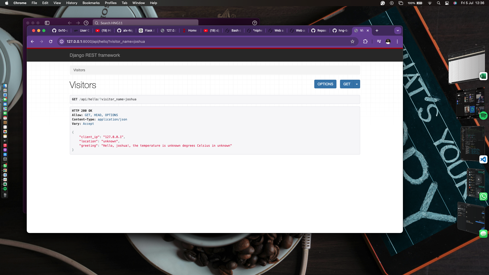

# hng-backend_stage_1

## Visitor API

This is a simple project built using Django to provide an API endpoint to greet visitors and provide their IP address, location, and current temperature. I deployed project on DigitalOcean's App Platform.

## Features

- **GET /api/visitor**: Returns the client's IP address, location, and a personalized greeting along with the current temperature of the location.

## Technologies Used

- Django
- Django REST Framework
- IP2Location API (for location data)
- OpenWeatherMap API (for weather data)

## Requirements

- Python 3.6+
- Django 3.0+
- Django REST Framework
- Requests
- Gunicorn
- pythondotenv
- Psycopg

## Installation

### Clone the Repository

```bash
git clone https://github.com/Niphemi00/HNG-internship/tree/main/weatherapp
cd weatherapp
```

### Set Up Virtual Environment

```bash
python3 -m .venv venv
source venv/bin/activate
```

### Install Dependencies

```bash
pip install -r requirements.txt
```

### Configure Environment Variables

Create a .env file in the project root and add your API keys:

```bash
SECRET_KEY=your_secret_key
DEBUG=True
IP2LOCATION_API_KEY=your_ip2location_api_key
OPENWEATHER_API_KEY=your_openweather_api_key
```

### Apply Migrations

```bash
python manage.py migrate
```

### Run the Server

```bash
python manage.py runserver
```
### IMPROPER CONFIGURATION 
If you get an error like this:
  USE
  $export DJANGO_SETTINGS_MODULE=foldername.settings
  $python manage.py runserver
## API Usage

### Endpoint: GET /api/visitor

#### Parameters

- visitor_name (optional): The name of the visitor to include in the greeting.

#### Example Request

```bash
curl "http://127.0.0.1:8000/api/hello?visitor_name=Mark"
```

#### Example Response

```json
{
  "client_ip": "203.0.113.195",
  "location": "New York",
  "greeting": "Hello, Mark! The temperature is 11 degrees Celsius in New York"
}
```

## Deployment

### Deploying to DigitalOcean App Platform

1. **Create a DigitalOcean Account**: [Sign up here](https://www.digitalocean.com).

2. **Create a New Project**: Log in to your DigitalOcean account and create a new project.

3. **Create a New App**: In your project, click "Create App" and follow the prompts to deploy your application.

4. **Configure Environment Variables**: Set the IP2LOCATION_API_KEY and OPENWEATHER_API_KEY environment variables in the App Platform dashboard.

5. **Deploy**: Follow the prompts to deploy your app.

## Configuration

### Settings

The following settings are used in the project:

- IP2LOCATION_API_KEY: Your IP2Location API key for getting location data.
- OPENWEATHER_API_KEY: Your OpenWeatherMap API key for getting weather data.

### Middleware

Ensure your middleware is correctly set up to handle X-Forwarded-For headers for accurate client IP detection:

```python
MIDDLEWARE = [
    ...
    'django.middleware.security.SecurityMiddleware',
    'django.contrib.sessions.middleware.SessionMiddleware',
    'django.middleware.common.CommonMiddleware',
    'django.middleware.csrf.CsrfViewMiddleware',
    'django.contrib.auth.middleware.AuthenticationMiddleware',
    'django.contrib.messages.middleware.MessageMiddleware',
    'django.middleware.clickjacking.XFrameOptionsMiddleware',
    'django.middleware.http.ConditionalGetMiddleware',
]
```

## Endpoint Preview

